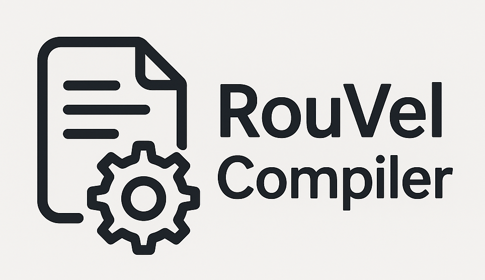

# RouVel Compiler

Trabajo práctico de cursada para la materia Compiladores e Intérpretes.

A partir de un lenguaje simple proporcionado por la cátedra, se implementó su compilador.



## Índice

- [Características del lenguaje](resources/markdown/language.md)
- [Analizador léxico](resources/markdown/lexer.md)
- [Analziador sintáctico](resources/markdown/parser.md)

## Instalación

### Construcción de la Imagen

A esto solo debe hacerlo una vez y puede que tarde unos pocos minutos.

```bash
docker build -t tpe-compiler .
```

### Levantamiento del Contenedor

Debe especificar la ruta del archivo `.uki` a compilar. Dichos archivos deben hallarse en un subdirectorio de la carpeta del proyecto (si se copia el comando tal y como se especifica debajo) o remplazar lo previo a `:/data` con el directorio a montar.

#### Linux/macOS

```sh
docker run --rm -v "$(pwd)":/data tpe-compiler /data/archivo.uki
```

Ejemplo utilizando los archivos de prueba proporcionados:

```sh
docker run --rm -v "$(pwd)":/data tpe-compiler /data/resources/testFiles/test1.uki
```

#### Windows (CMD)

```sh
docker run --rm -v "%cd%":/data tpe-compiler /data/archivo.uki
```

#### Windows (PowerShell)

```sh
docker run --rm -v "${PWD}:/data" tpe-compiler /data/archivo.uki
```
