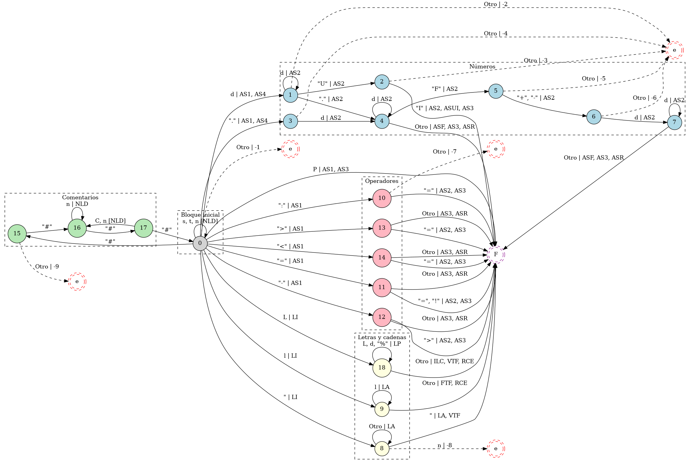

# RouVel Compiler

Trabajo práctico de cursada para la materia Compiladores e Intérpretes.

A partir de un lenguaje simple proporcionado por la cátedra, se implementó su compilador lenguaje. Las características del lenguaje son las siguientes:

## Anaizador Léxico

### Autómata Finito

Se define:

- L: conjunto de todos los carácteres correspondientes a letras mayúsculas.
- l: conjunto de todos los carácteres correspondientes a letras minúsculas.
- d: conjunto de carácteres correspondientes a dígitos (0 a 9).
- Los carácteres específicos serán indicados entre comillas simples (" y "), exceptuando por el carácter correspondiente a estas ("), que será indicado en solitario, ya que indicarlo entre comillas afecta a la claridad del autómata (""").
- s: indica un espacio en blanco.
- t: indica una tabulación.
- n: indica un salto de línea.
- Se define P el conjunto de los siguientes símbolos de un carácter. P = {+, \*, /, (, ), {, }, \_, ;}.
- Otro: representa a un carácter que no está comprendido en los demás arcos.

Además, se definen las siguientes acciones semánticas (AS), en orden alfabérico:

- `FixedTokenFinalizer` (FTF):
- `FloatChecker` (FC):
- `IdentifierLengthChecker` (ILC):
- `LexemaAppender` (LA): agrega caracter leído al string del lexema.
- `LexemaInitializer` (LI): inicializa el string del lexema y agrega caracter leido.
- `NewLineDetected` (NLD): incrementa el número de línea.
- `ReturnCharacterToEntry` (RCE): decrementa la referencia al siguiente caracter a leer (devolviendo así el último caracter leído a la entrada).
- `UintChecker` (UIC): se eliminan los trailing zeros, se verifica que el número está dentro del rango de uint. Si no, entonces se le da el valor máximo del rango.
- `VariableTokenFinalizer` (VTF):

## Decisiones

Decidimos minimizar la cantidad de acciones semánticas a aplicar a costa de aumentar el número de estados en el autómata finito. De esta forma:

- El autómata se autoexplica. No es necesario recurrir al código constantemente para entenderlo.
- Se facilita el debugging, ya que se minimiza el código.

Se define:

¿Qué hacemos si viene un <==? Es ambiguo. Tomamos como vaya llegando.

    // No es necesario contemplar el salto de línea porque, al
    // retrocederse en el carácter, se vuelve a leer.

LOS ARCHIVOS .UKI DEBEN ESTAR CODIFICADOS CON UTF-8. Si se codifican con UTF-8 with BOM, da error.

----DUDAS----
-79.F ¿Número 79. y luego identificador F? O ¿intento fallido de flotante?

0.0UI ¿Número flotante 0. y numero UINT 0UI? Lo toma como flotante 0.0

010201101.F-00000.0 Detecta dos tokens, dos flotantes, siendo el segundo ".0". ¿Debería dar error porque se intenta poner un flotante como exponente de otro flotante o está bien que identifique dos flotantes distintos?

Cuando nuestro programa guarda las constantes como 0., las guarda como 0.0, para mayor legibilidad. ¿Está bien que haga eso? Si encuentra un número como 0.000000000001, ¿está bien que lo guarde en notación científica? ¿Tenemos esas libertades?

Estando en el estado 1 es distinto el error si se quiere escribir un UINT a si se quiere escribir un float. Pero no hay forma de darse cuenta.

Quisimos adecuarnos a la convención utilizado para la cátedra y, si bien está buena para ejemplos concretos, en un grafo grande puede ser algo tedioso. Por eso, definimos nuestra convención como sigue:

En caso de venir un solo #, ¿cómo se maneja? Podrían contarse los # que siguen y determinar si fue un intento de comentario. Pero podría haber "#" dentro de los comentarios.

En InvalidAssignmentOperator podría asumirse que, si se puso :, se quiso realizar una asignación.

31.2UI ---> No vamos a hacernos casos de este error.

## Instalación

Ejecute el _script_ correspondiente a su sistema operativo en el directorio `resources/install` del proyecto. Esto instalará automáticamente las versiones necesarias de Java, OpenJDK y Maven. Luego, ejecute el _script_ de `run.sh` para correr el programa.

## Dudas

- ¿Muchas AS en un mismo arco?
- ¿Escalable o fijo y adecuado al problema?

TokenType identifica todos los tipos de tokens.

El sintáctico, además de poder acceder al token, debe poder acceder a la línea. El semántico ya no va a necesitar el número de línea.
