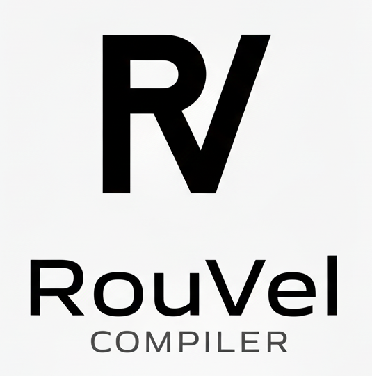

# RouVel Compiler

Trabajo práctico de cursada para la materia Compiladores e Intérpretes.

A partir de un lenguaje simple proporcionado por la cátedra, al que se denominó UKI, se implementó su compilador.



## Ejecución

A continuación, se detallará la ejecución del programa utilizando el archivo _jar_. Para ello, debe tener instalado Java. No obstante, también, si lo desea, existe la posibilidad de ejecutarlo usando Docker: [¿Cómo ejecutó el programa usando Docker?](resources/markdown/docker.md)

El programa funciona tanto con rutas absolutas como relativas. En `resources/testFiles` se proporcionan códigos de ejemplo para probarlo.

Para ejecutar el programa, debe posicionarse en la carpeta del proyecto y ejecutar:

```sh
java -jar rouvel-compiler.jar <archivo>
```

Por ejemplo:

```sh
java -jar rouvel-compiler.jar resources/testFiles/ejemplo.uki
```
