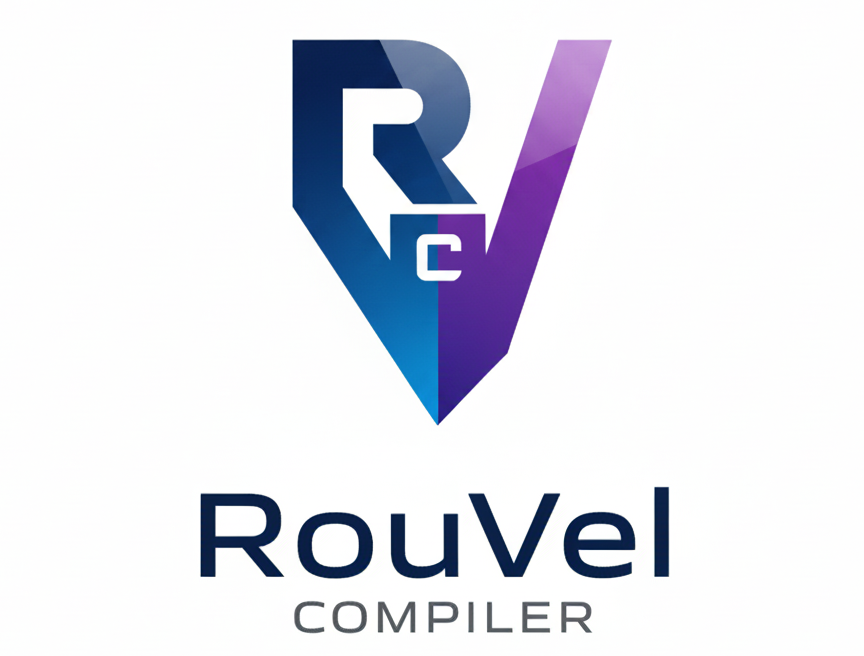

# RouVel Compiler

Trabajo práctico de cursada para la materia Compiladores e Intérpretes.

A partir de un lenguaje simple proporcionado por la cátedra, al que se denominó UKI, se implementó su compilador.



## Ejecución

A continuación, se detallará la ejecución del programa utilizando el archivo _jar_. Para ello, debe tener instaladas las últimas versiones de Java y JDK. Para ello, puede acceder al siguiente enlace: <https://www.oracle.com/java/technologies/downloads/#java25> y seguir los pasos correspondientes a su Sistema Operativo. No obstante, también, si lo desea, existe la posibilidad de ejecutarlo usando Docker: [¿Cómo ejecutó el programa usando Docker?](resources/markdown/docker.md)

El programa funciona tanto con rutas absolutas como relativas. En `resources/testFiles` se proporcionan códigos de ejemplo para probarlo.

> [!IMPORTANT]
> Si ejecuta el archivo en Windows, antes de compilar un programa, debe asegurarse de que la codificación del archivo sea UTF-8 y el _end line separator_ sea LF, en lugar de CRLF, que es el utilizado por defecto en Windows.

Para ejecutar el programa, debe posicionarse en la carpeta del proyecto y ejecutar:

```sh
java -jar rouvel-compiler.jar <archivo>
```

Por ejemplo:

```sh
java -jar rouvel-compiler.jar resources/testFiles/ejemplo.uki
```

Si desea, puede redirigir la salida a un archivo para observarla mejor. Por ejemplo, en Linux, esto se consigue de la siguiente forma:

```sh
java -jar rouvel-compiler.jar resources/testFiles/ejemplo.uki > resultados-compilacion.txt
```
